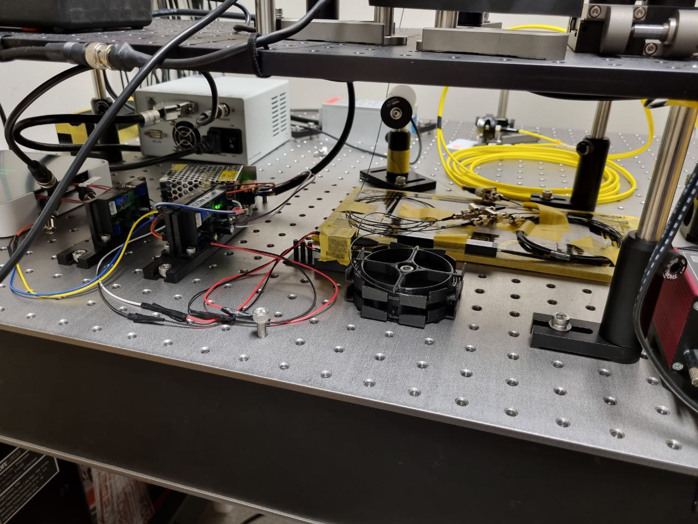

# Fiber Coupled Laser Illumination

This repository contains all the necessary materials and instructions for installing an open source system for fiber coupled illumination in microscopy. This system features lasers with various wavelengths coupled in a single optic fiber, enabling easy digital selection without any structural modifications. The document includes a list of required materials, step-by-step assembly instructions, and configurations.

Our goal is to provide a fully functional, research-grade equipment that delivers excellent performance. The system is modular, allowing individual parts to be repurposed and improved in the open source hardware sense, and easily combined, exchanged, or used on their own.
As an open collaborative project, we warmly welcome your participation. Please feel free to leave comments, provide input, and make contributions by submitting your message as an issue in this repository.

# Table of Contents

1. Specifications
2. General Description
3. Materials
   - Lasers
   - Electronics
   - 3D models
4. Montage
5. Configurations
6. Usage

# Specifications

This system bla bla bla

# General Description
Image of the entire montage with labels [This is not the final montage yet]

# Materials
## Lasers
## Electronics
## 3D models
 
