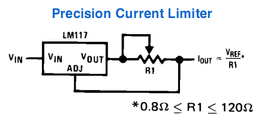

# Current Limiting Circuit

An electronic card is designed that limits the current delivered by the adjustable current source (laser driver) for 2 reasons.

1.- Limit laser optical power to 300 mW corresponding to **class 3B** according to  [ANSI Z136.1](docu/2019120664752977.pdf) international standard. "*Safe Use Of Lasers*", such that the risks of manipulation with lasers of higher optical power are reduced.

2.- Avoid damaging lasers whose maximum operating current is less than that delivered by the adjustable current source (laser driver).

The topology used is the following:

* Vin corresponds to pin + of the LD output that powers the laser from the adjustable current source (laser driver)
* Iout connects to the laser cathode
* The ground of the laser driver (pin - LD) connects directly to the laser anode
* R1 is calculated according to the current to be limited.