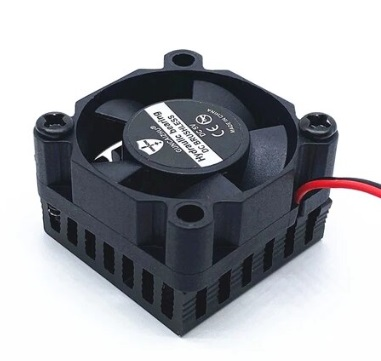
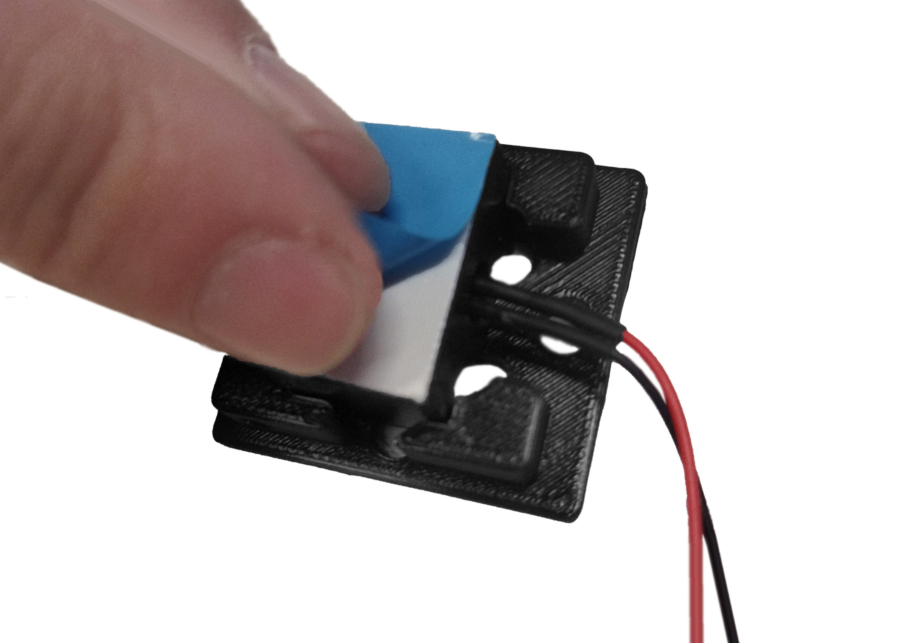
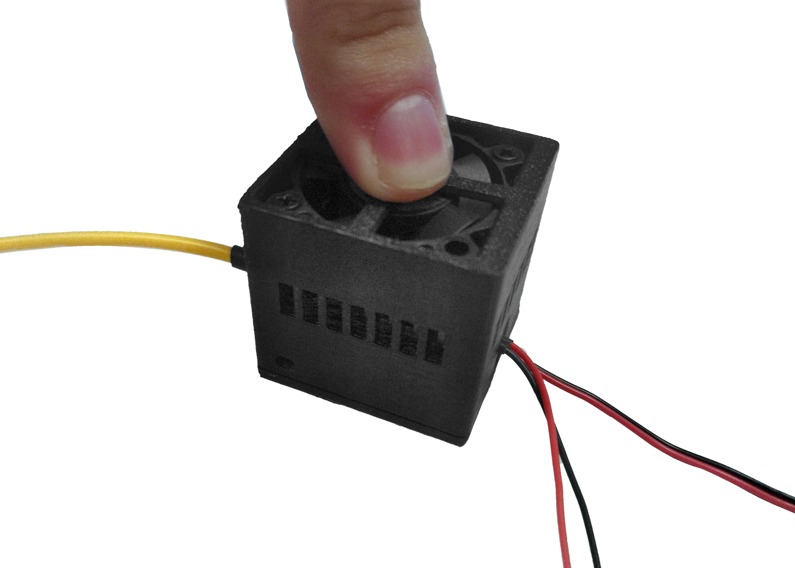
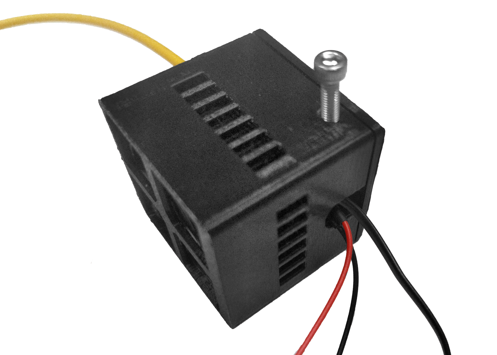

[tapa]: models/ventiladorb.stl "{previewpage}"
[casing]: models/ventiladort.stl "{previewpage}"

# Módulo control de temperatura

## Acomplamiento disipador láser con la tapa {pagestep}

Posicionar y acoplar disipador de láser en la [tapa] sin torcer fibra para evitar daños.

## Pegado de cinta térmica {pagestep}

Pegar cinta térmica adhesiva en disipador de láser acoplado en la [tapa].

## Acomplamiento ventilador con casing {pagestep}

Posicionar y acoplar el [ventilador con disipador](https://es.aliexpress.com/item/32406706193.html?srcSns=sns_Copy&spreadType=socialShare&bizType=ProductDetail&social_params=21260363990&aff_fcid=8f0909942d514555be594e64ddb2260f-1704293970899-09731-_msGmWnW&tt=MG&aff_fsk=_msGmWnW&aff_platform=default&sk=_msGmWnW&aff_trace_key=8f0909942d514555be594e64ddb2260f-1704293970899-09731-_msGmWnW&shareId=21260363990&businessType=ProductDetail&platform=AE&terminal_id=1c7dbf56fc6547ef8fa57d8207a07536&afSmartRedirect=y) en el [casing] pasando cables por ranura.  

  
>!
>! Tener cuidado de no aplastar los cables del ventilador. 

## Ensamblaje final {pagestep}

Desprender capa azul de cinta térmica adherida al disipador del láser.

Acoplar [casing] (ventilador previamente insertado) con [tapa] (disipador y cinta térmica previamente unidos)

Atornillar pernos M3 de 10 mm para fijar ambas partes.

