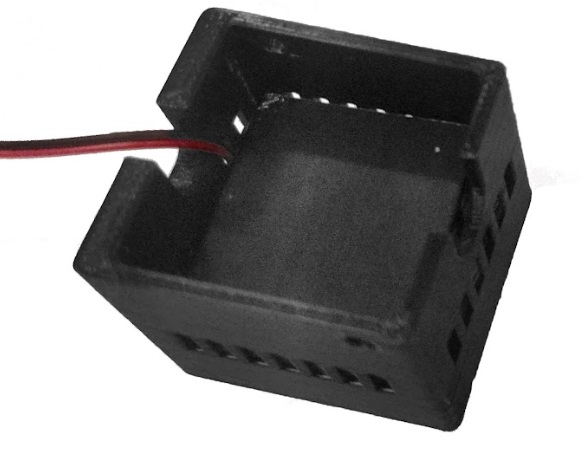

[cover]: models/ventiladorb.stl "{previewpage}"
[casing]: models/ventiladort.stl "{previewpage}"

# Temperature control module

## Laser dissipator coupling with cover {pagestep}

Position and attach the laser heatsink to the [cover] without twisting the fiber to avoid damage.

## Thermal tape gluing {pagestep}

Paste adhesive thermal tape on laser heatsink attached to the [cover].

## Fan coupling with casing {pagestep}

Position and attach the [fan with heatsink](https://es.aliexpress.com/item/32406706193.html?srcSns=sns_Copy&spreadType=socialShare&bizType=ProductDetail&social_params=21260363990&aff_fcid=8f0909942d514555be594e64ddb2260f-1704293970899-09731-_msGmWnW&tt=MG&aff_fsk=_msGmWnW&aff_platform=default&sk=_msGmWnW&aff_trace_key=8f0909942d514555be594e64ddb2260f-1704293970899-09731-_msGmWnW&shareId=21260363990&businessType=ProductDetail&platform=AE&terminal_id=1c7dbf56fc6547ef8fa57d8207a07536&afSmartRedirect=y) in the [casing] passing cables through the slot.  

  
>!
>! **Warning** Be careful not to crush the fan cables.

## Final assembly {pagestep}

Remove the blue layer of thermal tape adhered to the laser heatsink.

Attach [casing] (previously inserted fan) with [cover] (previously attached heatsink and thermal tape)

Screw 10mm M3 bolts to fix both parts.

