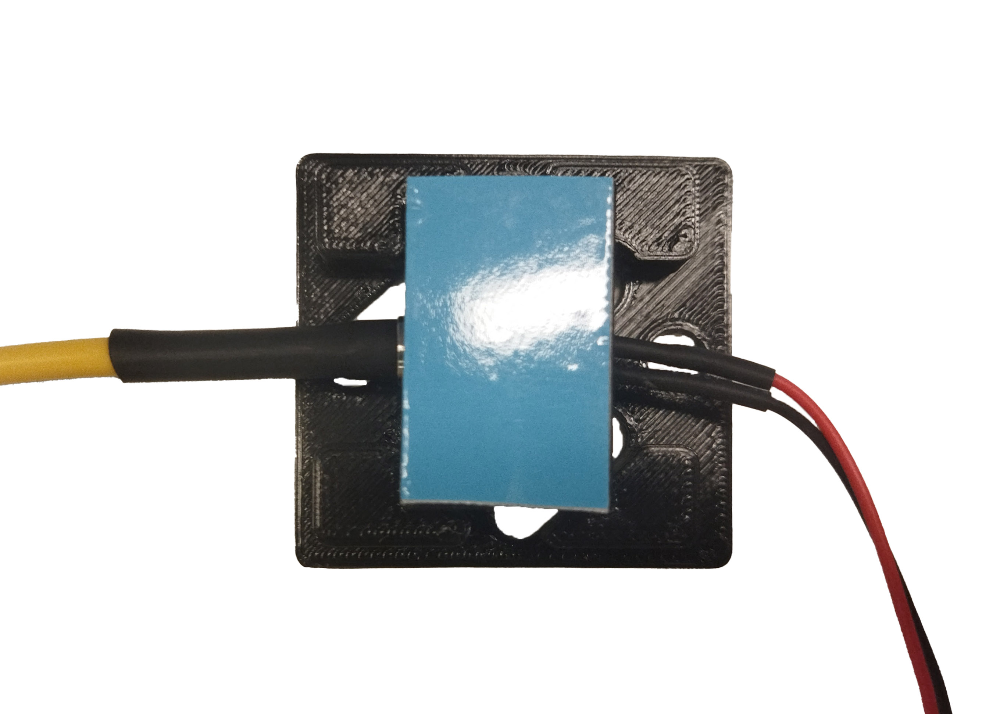

[lid]: models/ventiladorb.stl "{previewpage}"
[case]: models/ventiladort.stl "{previewpage}"

# Temperature control module

>! **Caution** 
>! To avoid damage to the laser fiber, do not strain, bend, or induce sharp curvatures when handling. 

The following steps will assemble a temperature control box using the following 3D printed parts: [case], and [lid], in addition to the following materials: [fiber coupled laser with heatsink block*](images/laserl2.png), [fan with heatsink](https://a.aliexpress.com/_msGmWnW), [adhesive thermal tape](https://es.aliexpress.com/item/4000233593859.html?src=google&src=google&albch=shopping&acnt=494-037-6276&slnk=&plac=&mtctp=&albbt=Google_7_shopping&albagn=888888&isSmbAutoCall=false&needSmbHouyi=false&albcp=17859513307&albag=&trgt=&crea=es4000233593859&netw=x&device=c&albpg=&albpd=es4000233593859&gad_source=1&gclid=CjwKCAiA9dGqBhAqEiwAmRpTC1_NdS-bISs9jKBG-U5wSOB7ionPE8S9TbrOqq4ufkRBIzhXIGao0hoChrEQAvD_BwE&gclsrc=aw.ds&aff_fcid=d8ea643ddb9c418ea42122ad2ade8f9a-1700062079709-02668-UneMJZVf&aff_fsk=UneMJZVf&aff_platform=aaf&sk=UneMJZVf&aff_trace_key=d8ea643ddb9c418ea42122ad2ade8f9a-1700062079709-02668-UneMJZVf&terminal_id=1c7dbf56fc6547ef8fa57d8207a07536&afSmartRedirect=y). 

>i **Note** 
>i You could buy the fiber coupled laser with heatsink block, different wavelengths and optical power in the company Shenzhen Guang Chuangfeng Technology Co., Ltd
 

## Laser dissipator coupling with cover {pagestep}

Position and attach the [laser heatsink block](images/laser-heatsink-block.png) in the [lid]. 

## Thermal tape gluing {pagestep}

Paste a segment of adhesive thermal tape on the laser heatsink block attached to the [lid].

## Fan coupling with casing {pagestep}

Position and attach the [fan with heatsink](https://es.aliexpress.com/item/32406706193.html?srcSns=sns_Copy&spreadType=socialShare&bizType=ProductDetail&social_params=21260363990&aff_fcid=8f0909942d514555be594e64ddb2260f-1704293970899-09731-_msGmWnW&tt=MG&aff_fsk=_msGmWnW&aff_platform=default&sk=_msGmWnW&aff_trace_key=8f0909942d514555be594e64ddb2260f-1704293970899-09731-_msGmWnW&shareId=21260363990&businessType=ProductDetail&platform=AE&terminal_id=1c7dbf56fc6547ef8fa57d8207a07536&afSmartRedirect=y) in the [case], passing cables through the slot.  

  
>!
>! **Warning** Be careful not to strain the fan cables.

## Final assembly {pagestep}

Remove the thermal tape protective layer adhered to the laser heatsink block.

Attach [case] (previously inserted fan with heatsink) with [lid] (previously attached heatsink block and thermal tape)

Screw 10mm M3 bolts to fix both parts.

