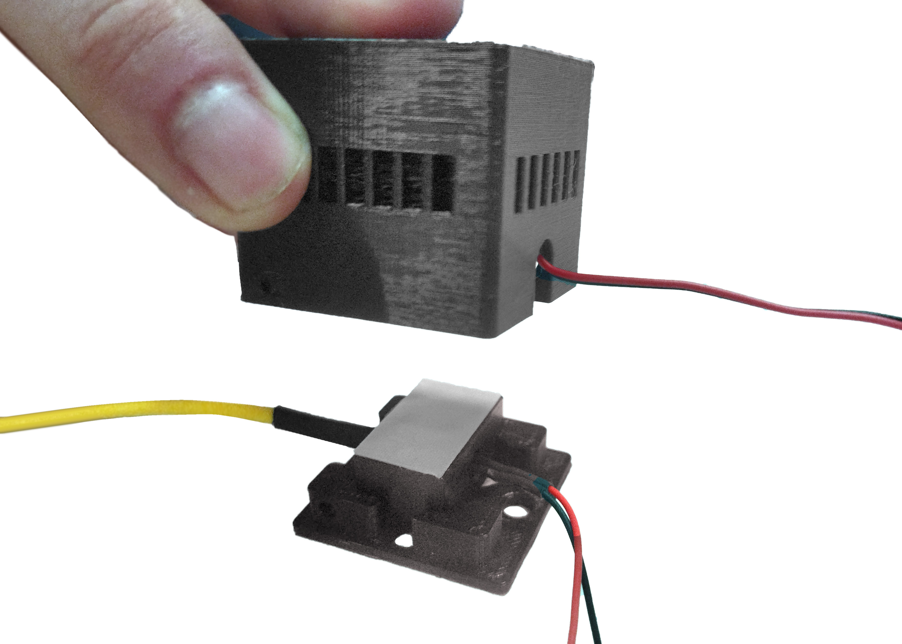

# Módulo control de temperatura

>i **Nota:** Este sitio esta en construcción.

## Acomplamiento disipador láser con la tapa {pagestep}

Posicionar y acoplar disipador de láser en la tapa sin torcer fibra para evitar daños.

## Acomplamiento ventilador con casing {pagestep}

Posicionar y acoplar el ventilador con disipador en el casing.

## Pegado de cinta térmica {pagestep}

Pegar cinta térmica adhesiva en disipador de láser acoplado en la tapa.

## Ensamblaje final {pagestep}

Desprender capa azul de cinta térmica adherida al disipador del láser.

Acoplar “Casing Ventilación Láser” (con el ventilador previamente insertado) con “Tapa Ventilación Láser” (disipador y cinta térmica previamente unidos)

Atornillar pernos M3 de 10 mm para fijar ambas partes.

