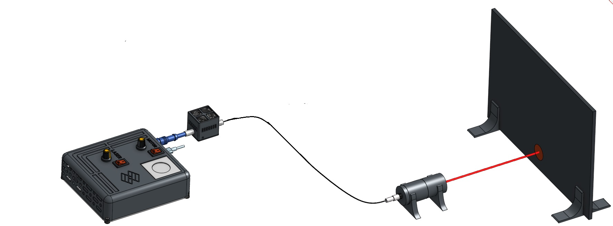

# Modular fiber-coupled laser illumination

El sistema modular de iluminación láser acoplada a fibra es un dispositivo libre y de fuente abierta. Este sistema puede utilizar láseres con varias longitudes de onda, acopladas en una sola fibra óptica, lo que permite una fácil selección digital sin modificaciones estructurales. Su diseño modular permite reutilizar y mejorar piezas individuales, combinarlas, intercambiarlas o utilizarlas fácilmente por sí solas.

>i **Nota:** Este sistema esta basado en algunos recursos de:
>i 
>i 1.- La plataforma [SQUID](https://github.com/prakashlab/squid-tracking).
>i *Li, Hongquan, et al. "Squid: simplifying quantitative imaging platform development and deployment." bioRxiv (2020): 2020-12.*
>i 
>i 2.- [Open-source laser engine](https://github.com/ries-lab/LaserEngine) *Schröder, Daniel, et al. "Cost-efficient open source laser engine for microscopy." Biomedical Optics Express 11.2 (2020): 609-623.*

Para aprender más sobre este sistema y otras tecnologías libres para bioimágenes, te invitamos a visitar la [página web de LIBRE hub](https://librehub.github.io/).