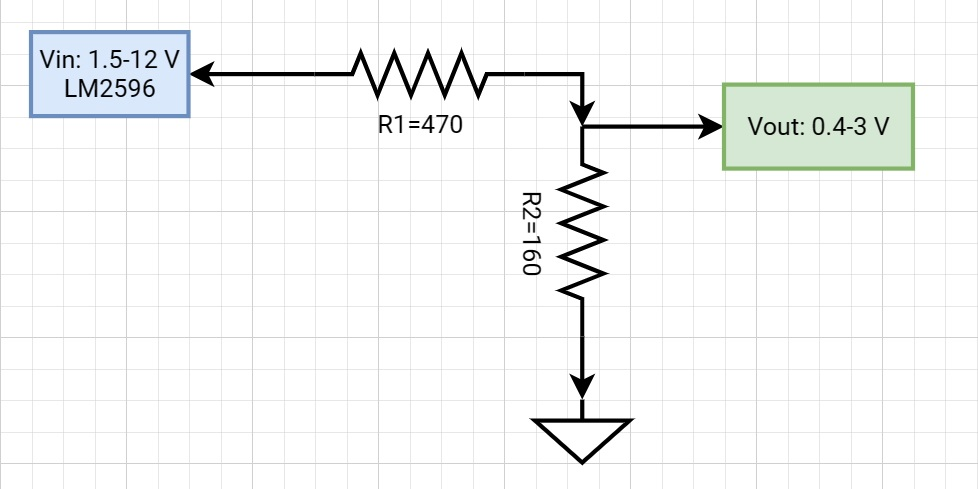
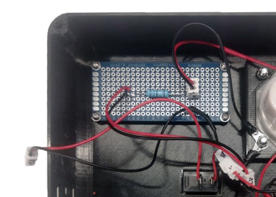
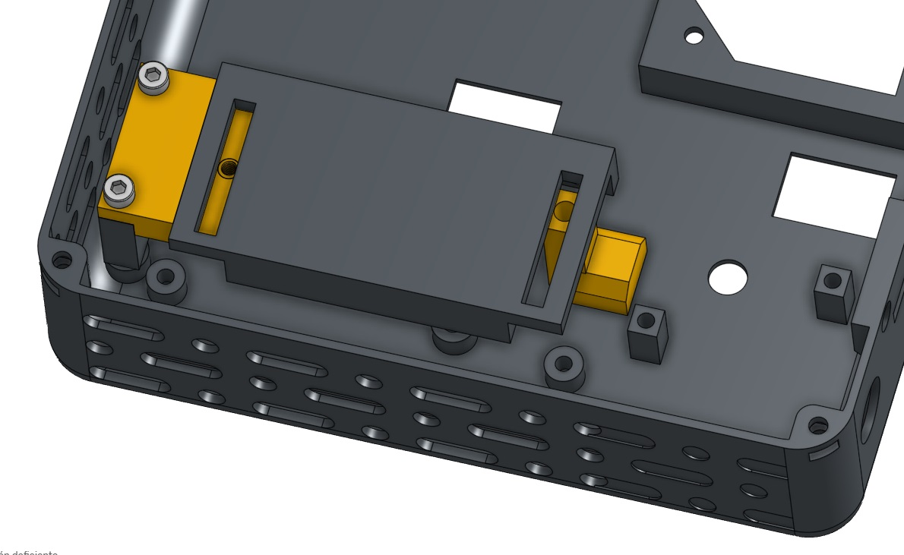
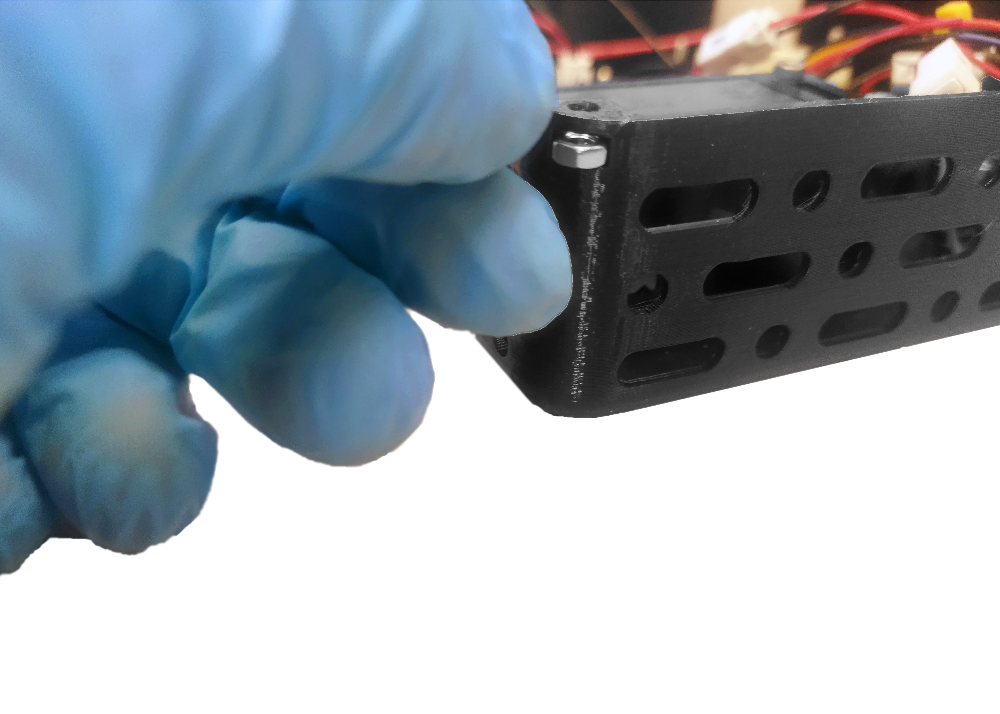

[panel]: models/casingt.stl "{previewpage}"
[adaptador plástico]: models/adaptadorusb.stl "{previewpage}"
[acrílico]: models/acrilico.stl "{previewpage}"
[separadores]: models/patabase.stl "{previewpage}"
[perilla 1]: models/manillac.stl "{previewpage}"
[perilla 2]: models/manillal.stl "{previewpage}"
[separador]: models/AdapterM2.stl "{previewpage}"
[S1]: models/S1.stl "{previewpage}"
[S2]: models/S2.stl "{previewpage}"
[S3]: models/S3.stl "{previewpage}"
[S4]: models/S4.stl "{previewpage}"
[S5]: models/S5.stl "{previewpage}"
[moteado]: docu/SpeckleReduction.pdf 
[sujetador]: models/sujetadorm.stl "{previewpage}"

# Módulo interfaz de usuario

## LM2596 {pagestep}

Posicionar tarjeta electrónica [LM2596](https://es.aliexpress.com/item/1005005884355026.html?src=google&src=google&albch=shopping&acnt=494-037-6276&slnk=&plac=&mtctp=&albbt=Google_7_shopping&albagn=888888&isSmbAutoCall=false&needSmbHouyi=false&albcp=17859513307&albag=&trgt=&crea=es1005005884355026&netw=x&device=c&albpg=&albpd=es1005005884355026&gad_source=1&gclid=Cj0KCQiAhc-sBhCEARIsAOVwHuT2EYaljYGahlmdOln5yWVvU6etmcrCXd0VNaStRu2sbJw3TMmHlawaAmkIEALw_wcB&gclsrc=aw.ds&aff_fcid=57167236473349af853ca0131f2933dd-1704235659440-03576-UneMJZVf&aff_fsk=UneMJZVf&aff_platform=aaf&sk=UneMJZVf&aff_trace_key=57167236473349af853ca0131f2933dd-1704235659440-03576-UneMJZVf&terminal_id=1c7dbf56fc6547ef8fa57d8207a07536&afSmartRedirect=y) tal que la posición del potenciómetro sea la correcta, acorde a la perforación del [panel]. Atornillar usando llave allen M3 y 2 pernos M3X12.

>i Esta tarjeta tiene soldado un divisor de tensión de tal forma que pueda entregar un voltaje regulado entre 0.4-3V. 

## Ajuste señuelo de carga {pagestep}

Ajuste de interruptores S1, S2, S3 en las posiciones 1, 0, 1 para que la [tarjeta electrónica morada](https://es.aliexpress.com/item/1005005545068349.html?src=google&src=google&albch=shopping&acnt=494-037-6276&slnk=&plac=&mtctp=&albbt=Google_7_shopping&albagn=888888&isSmbAutoCall=false&needSmbHouyi=false&albcp=17859513307&albag=&trgt=&crea=es1005005545068349&netw=x&device=c&albpg=&albpd=es1005005545068349&gad_source=1&gclid=Cj0KCQiAhc-sBhCEARIsAOVwHuSc41kMTyFCGuZivUT3Y83JiySAkngonaXl0KXYEmAv4M42LV6ynJwaAu4yEALw_wcB&gclsrc=aw.ds&aff_fcid=b4c5e71cd4cf46939412049bbef67a0c-1704235802247-05320-UneMJZVf&aff_fsk=UneMJZVf&aff_platform=aaf&sk=UneMJZVf&aff_trace_key=b4c5e71cd4cf46939412049bbef67a0c-1704235802247-05320-UneMJZVf&terminal_id=1c7dbf56fc6547ef8fa57d8207a07536&afSmartRedirect=y) entregue un voltaje de 12 V.   

>! La combinación de los interruptores puede variar acorde a la señalada. Para verificar por favor observe las combinaciones detalladas en la parte posterior de la tarjeta electrónica. 

## Interruptores {pagestep}

Introducir señuelo de carga (tarjeta electrónica morada) con interruptor previamente soldado, a través de la perforación para el interruptor del motor ubicada en el [panel]. *Este interruptor activa el [motor vibrador](https://www.google.com/url?q=http://aliexpress.com/item/32868996252.html&sa=D&source=editors&ust=1704301415884379&usg=AOvVaw0RUHXutocwyE4PJUE4tQv3)* y puede disminuir el [moteado] presente en el haz de luz del láser. 

>i En caso de que desee utilizar el motor vibrador, lo debe acoplar al [sujetador] y este a la vez a la fibra óptica del láser para transferir las vibraciones. 

Introducir el segundo interruptor a través de la perforación para el láser y presionar para fijar al [panel]. *Este interruptor activa el láser* 

>i Para el soldado de los interruptores por favor considere el siguiente [diagrama de conexiones eléctricas](docu/diagramaa.pdf)

## Ensamblaje de Señuelo de carga {pagestep}

Alinear la tarjeta electrónica morada con el [adaptador plástico] como se muestra a continuación.

Atornillar pernos M2x10 para fijar tarjeta electrónica. 

>i Se recomienda colocar pernos en [separador] para evitar cortocircuito. 

Insertar tuercas M3x10 y posteriormente fijar al [panel].

## Fijación de cable adaptador M12 {pagestep}

Introducir [conector M12](https://es.aliexpress.com/item/1005005922136440.html?gatewayAdapt=glo2esp) desde el interior de la [panel] en su respectiva perforación. Posteriormente fijar la tuerca M12.

## Amperímetro {pagestep}

Introducir y presionar [amperímetro](https://es.aliexpress.com/item/1005005867205046.html?gatewayAdapt=glo2esp) en el [panel].  Fijar amperímetro con tuercas M3.

## Fijación de circuito limitador de corriente {pagestep}

Posicionar y fijar tarjeta electrónica 3x7cm en [panel] usando 4 tornillos M2x10 incluidos. Respetar orientación acorde a las siguientes imágenes.

>i La tarjeta electrónica solo está incluida en los kits cuyo láser tenga una longitud de onda de 405 nm o 638 nm. Para más información ingrese al siguiente enlace [Circuito Limitador de Corriente](circuito.md) 

## Conexión de cables {pagestep}

Conectar cables A, B, C en la misma letra según corresponda. Conectar golillas K1 y K2 en las posiciones señaladas en amperímetro. 
Para la conexión de las golillas utilizar tuercas M3. Considerar el diagrama de conexiones eléctricas detallado a continuación: 

Conectar cables 12V y FAN a tarjeta "laser driver" en puertos 1 y 5; alimentación de 12 V y ventilador respectivamente.

 Para la conexión del puerto 2 (LD) del "laser driver", que corresponde a la salida de la fuente de corriente ajustable que alimenta el láser. Considerar lo siguiente: 
 
>i **En caso de que se incluya el circuito limitador de corriente**: Conectar puerto 2 del "laser driver" directamente a la tarjeta con el circuito limitador de corriente. Y posteriormente desde el puerto de salida del circuito limitador de corriente, conectar el pin + al amperímetro (K1) y el pin - al ánodo del láser, tal como se ilustra en diagrama eléctrico anteriormente descrito.  

>i **En caso de no incluir circuito limitador de corriente**: Conectar pin + del puerto LD del "laser driver" directamente al amperímetro (K1), y el pin - al ánodo del láser. 
 

A continuación, se muestran fotografías del "laser driver" incluido en kit, junto a imagen representativa de las conexiones. Las especificaciones técnicas del "laser driver" las puede encontrar en el siguiente link [Micost driver 500mA](docu/Micostdriver500mA20190819152341084108.pdf). 

>i
>i Los cables utilizados corresponden al modelo XH54 de 2 pines macho/hembra, pero se puede utilizar otro modelo que se disponga. 
>i 

## Fijación del driver laser {pagestep}

Voltear tarjeta de laser driver orientándola tal que el potenciómetro quede bien posicionado. Juntar y apernar separadores [S1] y [S2] usando pernos M3X25 directamente en [panel] acorde a la fotografía. Posicionar y presionar separador [S3] al [panel]. Finalmente apernar "laser driver" con 2 pernos M3x6 a los separadores.

>i
>i Para kit que incluye láser de 638nm posicionar y presionar separadores [S4] y [S5], para posteriormente apernar laser driver de 4A. Las especificaciones técnicas del "laser driver de 4A" las puede encontrar en el siguiente link [Micost driver 4A](docu/Micostdriver4A20190817120190389038.pdf).  

## Láminas protectoras del acrílico {pagestep}

Sacar láminas protectoras del [acrílico] de ambos lados

## Montaje de tapa acrílica {pagestep}

* Posicionar 4 tuercas M3 como se muestra en la siguiente imagen.

* Orientar tapa de [acrílico] como se muestra en la siguiente imagen. 
* Encajar [separadores] a 4 pernos M3x10, posteriormente apretar. 
* Pegar [gomas antideslizantes](https://es.aliexpress.com/item/1005003412557369.html) en cada perno.

## Ensamblaje de perillas {pagestep}

Posicionar y presionar [perilla 1] en perforación de motor y [perilla 2] en perforación de láser del [panel]. Posteriormente superponer [perillas](https://es.aliexpress.com/item/1005002892197056.html?spm=a2g0o.productlist.main.9.769156d0pQolYo&algo_pvid=c58c1c17-6ab1-425a-bfe0-7cc6cde3e98b&aem_p4p_detail=2024010217200310167946168983550001415481&algo_exp_id=c58c1c17-6ab1-425a-bfe0-7cc6cde3e98b-4&pdp_npi=4%40dis%21CLP%21790%21736.0%21%21%210.87%21%21%402103200617042448036492860e0b66%2112000022651901158%21sea%21CL%210%21AB&curPageLogUid=sHWBf4mLwUIh&search_p4p_id=2024010217200310167946168983550001415481_5) para mejorar agarre. 

A continuación, se comparte fotografía del módulo láser completamente ensamblado.

