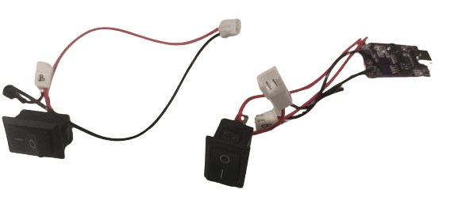

[panel]: models/casingt.stl "{previewpage}"
[plastic adapter]: models/adaptadorusb.stl "{previewpage}"
[acrylic]: models/acrilico.stl "{previewpage}"
[spacers]: models/patabase.stl "{previewpage}"
[knob 1]: models/manillac.stl "{previewpage}"
[knob 2]: models/manillal.stl "{previewpage}"
[separator]: models/AdapterM2.stl "{previewpage}"
[S1]: models/S1.stl "{previewpage}"
[S2]: models/S2.stl "{previewpage}"
[S3]: models/S3.stl "{previewpage}"
[S4]: models/S4.stl "{previewpage}"
[S5]: models/S5.stl "{previewpage}"
[speckle]: docu/SpeckleReduction.pdf 
[holder]: models/sujetadorm.stl "{previewpage}"

# User Interface Module

## LM2596 {pagestep}

Position electronic card [LM2596](https://es.aliexpress.com/item/1005005884355026.html?src=google&src=google&albch=shopping&acnt=494-037-6276&slnk=&plac=&mtctp=&albbt=Google_7_shopping&albagn=888888&isSmbAutoCall=false&needSmbHouyi=false&albcp=17859513307&albag=&trgt=&crea=es1005005884355026&netw=x&device=c&albpg=&albpd=es1005005884355026&gad_source=1&gclid=Cj0KCQiAhc-sBhCEARIsAOVwHuT2EYaljYGahlmdOln5yWVvU6etmcrCXd0VNaStRu2sbJw3TMmHlawaAmkIEALw_wcB&gclsrc=aw.ds&aff_fcid=57167236473349af853ca0131f2933dd-1704235659440-03576-UneMJZVf&aff_fsk=UneMJZVf&aff_platform=aaf&sk=UneMJZVf&aff_trace_key=57167236473349af853ca0131f2933dd-1704235659440-03576-UneMJZVf&terminal_id=1c7dbf56fc6547ef8fa57d8207a07536&afSmartRedirect=y) such that the position of the potentiometer is correct, according to the perforation of the [panel]. Screw using M3 allen key and 2 M3X12mm bolts.

>i This electronic card has a voltage divider soldered on so that it can deliver a regulated voltage between 0.4-3V.

## Fast charge decoy trigger PD/QC/AFC {pagestep}

Set switches S1, S2, S3 to positions 1, 0, 1 so that the [purple electronic card](https://es.aliexpress.com/item/1005005545068349.html?src=google&src=google&albch=shopping&acnt=494-037-6276&slnk=&plac=&mtctp=&albbt=Google_7_shopping&albagn=888888&isSmbAutoCall=false&needSmbHouyi=false&albcp=17859513307&albag=&trgt=&crea=es1005005545068349&netw=x&device=c&albpg=&albpd=es1005005545068349&gad_source=1&gclid=Cj0KCQiAhc-sBhCEARIsAOVwHuSc41kMTyFCGuZivUT3Y83JiySAkngonaXl0KXYEmAv4M42LV6ynJwaAu4yEALw_wcB&gclsrc=aw.ds&aff_fcid=b4c5e71cd4cf46939412049bbef67a0c-1704235802247-05320-UneMJZVf&aff_fsk=UneMJZVf&aff_platform=aaf&sk=UneMJZVf&aff_trace_key=b4c5e71cd4cf46939412049bbef67a0c-1704235802247-05320-UneMJZVf&terminal_id=1c7dbf56fc6547ef8fa57d8207a07536&afSmartRedirect=y) supplies a voltage of 12V. 

>! The configuration of the switches may vary according to the one indicated. To verify please look at the combinations detailed on the back of the electronic card.

## Switches {pagestep}

Insert purple electronic card with previously soldered switch, through the hole for the motor switch located in the [panel]. *This switch activates the [vibrator micromotor](https://www.google.com/url?q=http://aliexpress.com/item/32868996252.html&sa=D&source=editors&ust=1704301415884379&usg=AOvVaw0RUHXutocwyE4PJUE4tQv3)* and can decrease the [speckle] present in the laser light beam.

>i If you want to use the vibrating micromotor, you must attach it to the [holder] and this at the same time to the laser's optical fiber to transfer the vibrations.

Insert the second switch through the laser hole and press to secure to [panel]. *This switch activates the laser*

>i For soldering the switches please consider the following [electrical connection diagram](docu/diagramaa.pdf)

## Purple electronic board assembly {pagestep}

Align the purple electronic board with the [plastic adapter] as shown below.

Screw two M2x10mm bolts to fix the electronic card.

>i It is recommended to place bolts on [separator] to avoid short circuit.

Insert two M3x10mm nuts and then fix to the [panel].

## M12 adapter cable fixing {pagestep}

Insert [M12 connector](https://es.aliexpress.com/item/1005005922136440.html?gatewayAdapt=glo2esp) from the inside of the [panel] in its respective perforation. Then fix the M12 nut.

## Ammeter {pagestep}

Insert and press [ammeter](https://es.aliexpress.com/item/1005005867205046.html?gatewayAdapt=glo2esp) in the [panel]. Fix ammeter with M3 nuts.

## Fixing current limiting circuit {pagestep}

Position and fix the 3x7cm electronic card on [panel] using the 4 M2x10 screws included. Respect guidance according to the following images.

>i The electronic card is only included in kits whose laser has a wavelength of 405 nm or 638 nm. For more information go to the following link [Current Limiting Circuit](circuito.md) 

## Cable connection {pagestep}

Connect wires A, B, C in the same letter as appropriate. Connect terminals K1 and K2 in the positions indicated on the ammeter.
To connect the RV2 terminals, use M3 nuts. Consider the electrical connection diagram detailed below:

Connect 12V and FAN cables to the "laser driver" card in ports 1 and 5; 12V power and fan respectively.

For connecting port 2 (LD) of the "laser driver", which corresponds to the output of the adjustable current source that powers the laser. Consider the following:
 
>i **If the current limiting circuit is included**: Connect port 2 of the laser driver directly to the card with the current limiting circuit. And subsequently from the output port of the current limiting circuit, connect the + pin to the ammeter (K1) and the - pin to the laser anode, as illustrated in the electrical diagram described above.

>i **If current limiting circuit is not included**: Connect pin + of the LD port of the "laser driver" directly to the ammeter (K1), and pin - to the laser anode.
 

Below are photographs of the "laser driver" included in the kit, along with a representative image of the connections. The technical specifications of the "laser driver" can be found in the following link [Micost driver 500mA](docu/Micostdriver500mA20190819152341084108.pdf). 

>i
>i The cables used correspond to the [XH54](https://es.aliexpress.com/item/1005002651680040.html?src=google&src=google&albch=shopping&acnt=494-037-6276&slnk=&plac=&mtctp=&albbt=Google_7_shopping&albagn=888888&isSmbAutoCall=false&needSmbHouyi=false&albcp=19756272873&albag=&trgt=&crea=es1005002651680040&netw=x&device=c&albpg=&albpd=es1005002651680040&gad_source=1&gclid=CjwKCAiA5L2tBhBTEiwAdSxJX6N-TeKjtYOg5u5QFeFcUWnQepTs7rZb536z-f1eM5rPAdRRDM6xXhoCOgUQAvD_BwE&gclsrc=aw.ds&aff_fcid=6e1c5eabbb324a789b4231d842098e40-1706030428788-07464-UneMJZVf&aff_fsk=UneMJZVf&aff_platform=aaf&sk=UneMJZVf&aff_trace_key=6e1c5eabbb324a789b4231d842098e40-1706030428788-07464-UneMJZVf&terminal_id=1c7dbf56fc6547ef8fa57d8207a07536&afSmartRedirect=y) model with 2 male/female pins, but another model that is available can be used.
>i 

## Fixing the laser driver {pagestep}

Flip the laser driver card, orienting it so that the potentiometer is well positioned. Join and bolt spacers [S1] and [S2] using M3X25 bolts directly to [panel] according to the photograph. Position and press separator [S3] to [panel]. Finally, bolt the "laser driver" with 2 M3x6 bolts to the spacers.

>i
>i For a kit that includes a 638nm laser, position and press spacers [S4] and [S5], and then screw on the 4A laser driver. The technical specifications of the "4A laser driver" can be found in the following link [Micost driver 4A](docu/Micostdriver4A20190817120190389038.pdf).  

>! **Warning** 
>!
>! For the position of the potentiometer to be correctly adjusted, you will probably have to redesign some dimensions of the separators S1, S2, S3 or S4 and S5. The above depend on the final position of the potentiometer in the electronic card (laser driver) that will use.

## Acrylic Protective Sheets {pagestep}

Remove protective sheets from the [acrylic] on both sides

## Acrylic part assembly {pagestep}

* Position 4 M3 nuts as shown in the following image.

* Orient [acrylic] cap as shown in the following image.
* Fit [spacers] to 4 M3x10 bolts, then tighten.
* Paste [non-slip rubber](https://es.aliexpress.com/item/1005003412557369.html) on each bolt.

## Knob assembly {pagestep}

Position and press [knob 1] in motor hole and [knob 2] in laser hole of [panel]. Later press [knobs](https://es.aliexpress.com/item/1005002892197056.html?spm=a2g0o.productlist.main.9.769156d0pQolYo&algo_pvid=c58c1c17-6ab1-425a-bfe0-7cc6cde3e98b&aem_p4p_detail=2024010217200310167946168983550001415481&algo_exp_id=c58c1c17-6ab1-425a-bfe0-7cc6cde3e98b-4&pdp_npi=4%40dis%21CLP%21790%21736.0%21%21%210.87%21%21%402103200617042448036492860e0b66%2112000022651901158%21sea%21CL%210%21AB&curPageLogUid=sHWBf4mLwUIh&search_p4p_id=2024010217200310167946168983550001415481_5) to improve grip.

Below is a photo of the fully assembled laser module.

