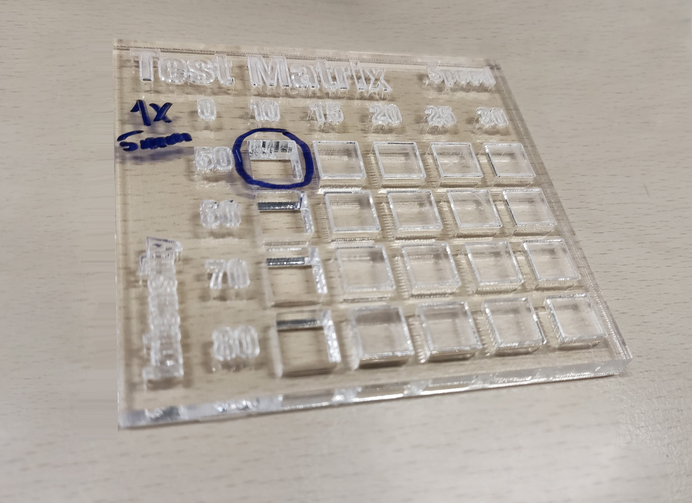

# Laser cut the acrylic parts

{{BOM}}

[Acrylic sheet]: parts/materials/acrylic-sheet.md "{cat:material}"
[Laser cutting machine]: parts/tools/laser-cutting-machine.md "{cat:tool}"

## Set your laser cutting machine settings {pagestep}

Laser-cutting acrylics is relatively simple. The basic steps for achieving good-quality cut acrylic parts are listed [here].

Settings for laser cutting acrylics will vary according to the machine. The table below lists the settings we used: 

|Setting     |Value        |
|------------|--           |
|Material    |Acrylic 3mm |
|Power (W)   |40 |
|Speed (mm/s)|20 |

We recommend testing the parameters for acrylic laser cutting using a test matrix. Download and laser cut the [test matrix](parts/materials/test-matrix.md) file. This will only use about an 8x9x0.5cm acrylic sheet.

The result should look like this:

## Laser cutting {pagestep}

Now you have tested your [laser cutting machine][Laser cutting machine]{qty: 1} and [acrylic sheet][Acrylic sheet]{Qty: 1} you can laser cut the following parts:

### Remove film

* If there is protective film on the acrylic, remove it now.

* Your plates are now prepared and ready to use.

[guide to tapping acrylic]: http://www.ultimatehandyman.co.uk/how-to/acrylic/tapping-acrylic
[here]: https://www.xometry.com/resources/sheet/about-laser-cutting-acrylic/