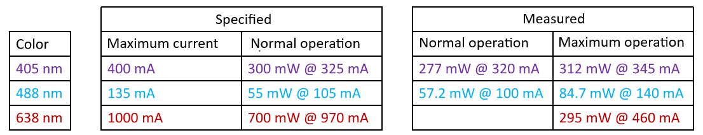
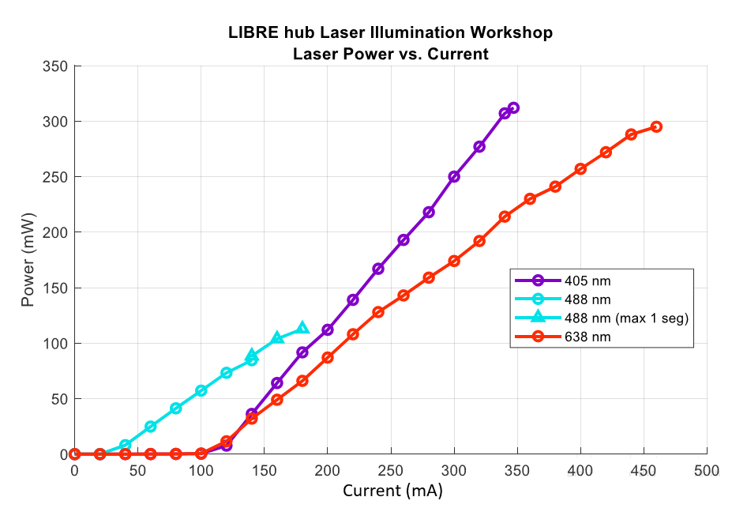

# Laser diode characterization 

* Optical power was recorded with a meter [PM400](https://www.thorlabs.com/thorproduct.cfm?partnumber=PM400) + [S121C](https://www.thorlabs.com/thorproduct.cfm?partnumber=S121C).
* Measurements made after 10 min of turning on the laser, in workshop modules, including current limitation.

If you required additional information you can get into the following link [Laser module integration extension assembly](docu/2023-12-12-Assembly-extension-integration-of-laser-modules.pdf) 
