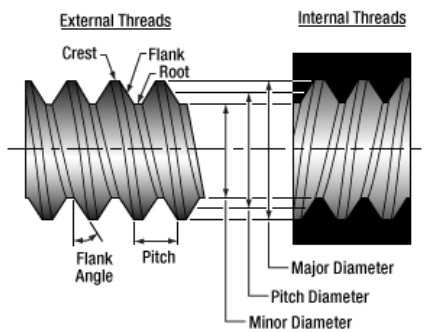
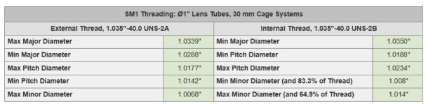

[adaptadorfibra-TL]: models/adaptadorfibra-TL.stl "{previewpage}"
[anillo-TL]: models/anillo-TL.stl "{previewpage}"
[difusor-TL]: models/difusor-TL.stl "{previewpage}"
[tubo-TL]: models/tubo-TL.stl "{previewpage}"
[tubolente-TL]: models/tubolente-TL.stl "{previewpage}"
---

# Thread 1.035"-40.0 TPI

Whether for the design of internal or external threads, 4 fundamental parameters must be taken into consideration, which are: Flank Angle, Pitch, Major Diameter and Minor Diameter.

Some important definitions to consider are the following:

● *Pitch*: It is the distance between adjacent threads, known as thread pitch.

● *Flank*: The flank angle is defined as the angle that the flank forms with a
line perpendicular to the axis of the screw.

● *Major Diameter*: It is measured from the crests of a thread

● *Minor Diameter*: It is measured from the valleys/root of a thread

Taking into consideration the above, both internal and external threads were designed that were compatible with optical parts that use the 1.035"-40TPI thread, using the OnShape software. 

In case compatibility with the 1.035"-40TPI thread is required, you can download the models with thread in STL format in a single zipfile file [3D Models Threads](docu/modelsthread.zip). You can also download each part with 1.035"-40TPI thread separately: [adaptadorfibra-TL], [anillo-TL], [difusor-TL], [tubo-TL], [tubolente-TL]. 
