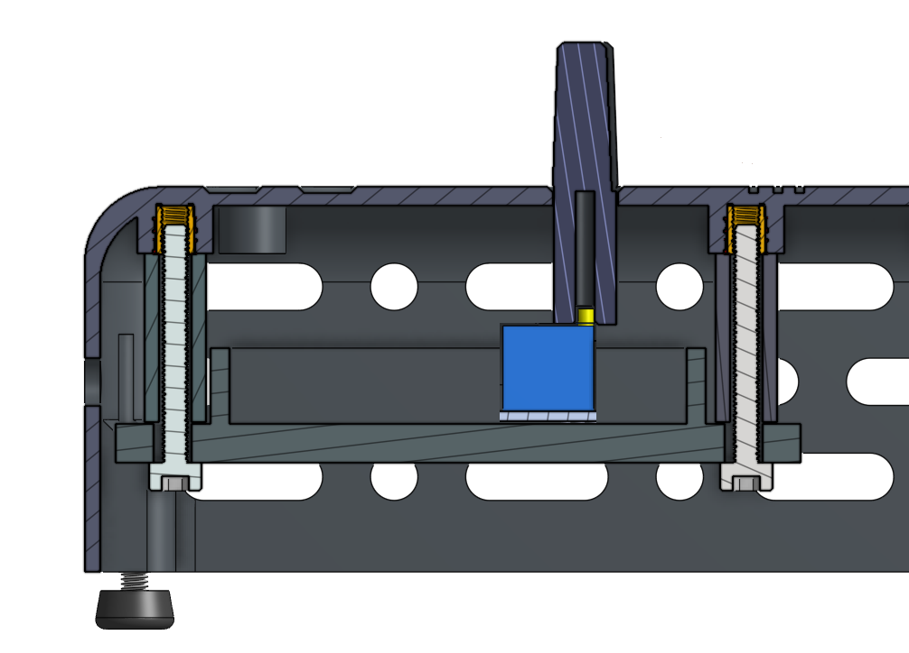
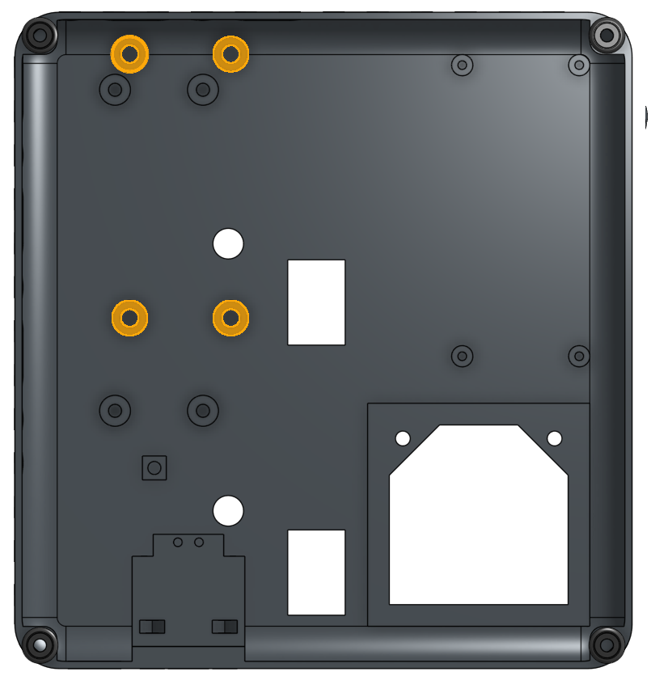
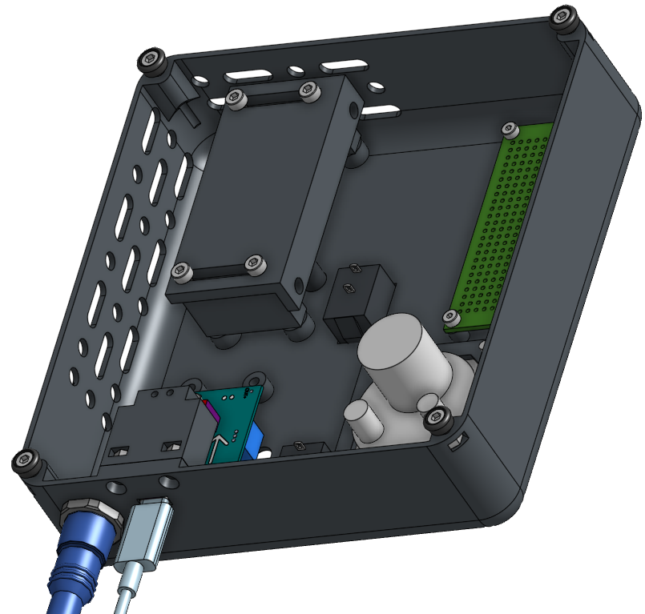
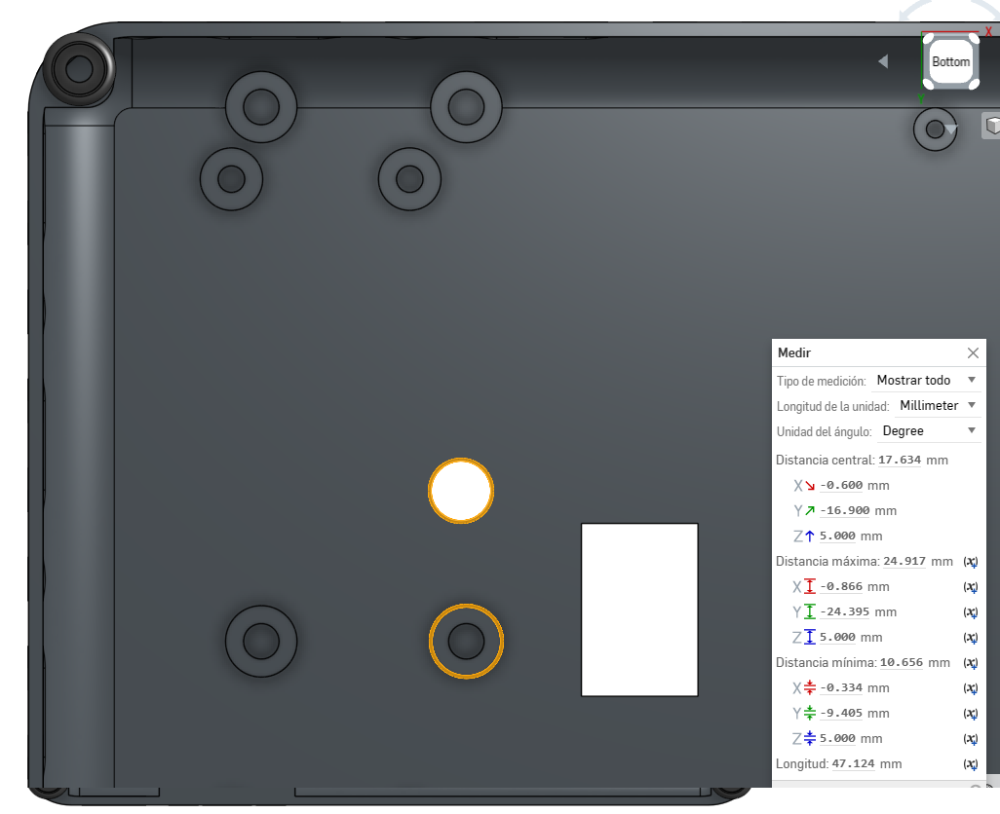
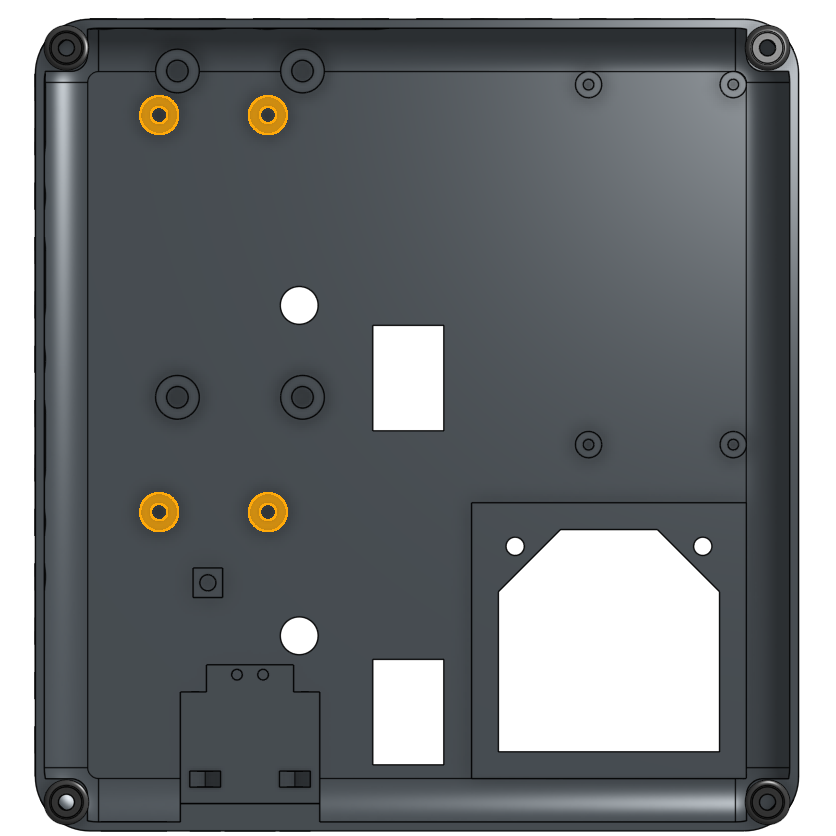

[S1]: models/S1.stl "{previewpage}"

# Separators

The separators are designed with the objective of:

1.- Align the central position of the laser driver potentiometer handle with the hole in the panel, leaving the electronic card fixed.

2.- Avoid redesigning the panel that has a printing time of around 8 hours.

Taking the above into consideration, let's take as an example the design of the separator [S1] to leave the laser driver [Micost driver 500mA](docu/Micostdriver500mA20190819152341084108.pdf) fixed in its correct position.

* The first thing to keep in mind is that there are at least 4 holes in the panel that allow you to insert ['heat inserts'](https://es.aliexpress.com/item/1005002069529871.html?gatewayAdapt=glo2esp), whose dimensions are M3x5 mm. The function of these is to fix the spacers next to the laser driver using M3X25 bolts, as can be seen in the following images.

>i
>i The proper way to fix the 'heat inserts' to the panel can be seen in the following [video](https://youtu.be/P7nHyI1TwKY?feature=shared&t=209). 

* The central distance from the nearest hole with the 'heat insert' to the hole with the potentiometer knob is (x,y)=(0.6,16.9), as can be seen in the following image.

>! **Warning** 
>!
>! Consider that the central distance may be different, due to changes in the position of potentiometer the 'laser driver' , for which modifications must be made to the separators, without making changes to the panel design. To redesign the separators, the other 4 perforations can be used and in combination with those with 'heat inserts', as detailed in [Step 9: Fixing the laser driver](interfaz-usuario.md).

