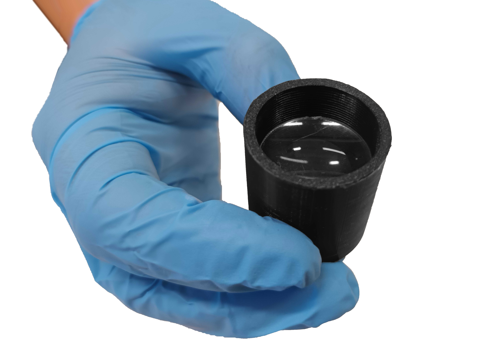

[inner ring]: models/anillo.stl "{previewpage}"
[ring tool]: models/Herramienta.stl  "{previewpage}"
[optical tube]: models/tubo.stl  "{previewpage}"
[clamps]: models/abrazadera.stl "{previewpage}"
[laser fiber adapter]: models/adaptadorfibra.stl "{previewpage}"
[diffuser]: models/Difusor.stl "{previewpage}"
[surface holders]: models/sujetador.stl "{previewpage}"
[adjustable lens tube]: models/Tubolente.stl "{previewpage}"

# Optical Module

>! **Warning** Use nitrile gloves when handling all parts of the optical module. *Take special care with the lenses and the laser fiber.*

## Optical Lens {pagestep}

Insert [inner ring] into the [ring tool]. Then, insert into the [optical tube] and rotate to a minimum depth of 6mm to later insert the lens and second internal ring.

Insert lens into [optical tube].

Fit the second [inner ring] on the [ring tool], insert into the [optical tube] and screw until tightening the lens in place between the two internal rings.

## Optical tubes {pagestep}

For this step, you must have the [optical tube] with its attached lens, assembled in the previous step.

Fit both tubes and screw until the end.

  

## Base {pagestep}

For this step, you must have the extended optical tube, assembled in the previous step.

Two tube [clamps] will be used to hold the light output parallel to a horizontal surface. Place the two tube clamps on a horizontal surface at a distance of 25 mm between both parts. Then, fit the [optical tube] into both clamps by pressing down on the tube on top of the clamps.

  

## Fiber laser adapter {pagestep}

For this step, you must have the extended optical tube with the clamps, assembled in the previous step.

Fit [laser fiber adapter] and turn all the way.

  

Remove laser cap, assemble laser with [fiber laser adapter] and turn laser adapter all the way.

>! **Warning** Do not touch fiber optics. Manipulate components as shown in the images.

  

The assembly should look like the image below.

## Laser aiming surface {pagestep}

To test the operation of the laser safely, we recommend using a flat, black surface to terminate the laser propagation. Included in the kit are a piece of black cardboard and two [surface holders] for this purpose.

## Diffuser {pagestep}

To perform optical tests that require the use of [diffuser]:

* Make sure the laser is turned off before adjusting elements in the light path. Take apart the extended tube by unscrewing apart both segments. 
* Cover the aperture of the [diffuser] holder inner ring using a segment of clear diffusing adhesive tape.
* Fit the [diffuser] holder inner ring into the [ring tool] and insert the diffuser into the optical tube screwing from the open side of the tube closest to the [laser fiber adapter]. Reassemble the extended tube by screwing the tube segments together.

## Adjustable Lens Tube {pagestep}

Make sure the laser is turned off before adjusting elements in the light path. For activity that requires adjusting the position of the lens depending on its focal length, you could replace and use the [adjustable lens tube] part instead of one of the optical tubes.

